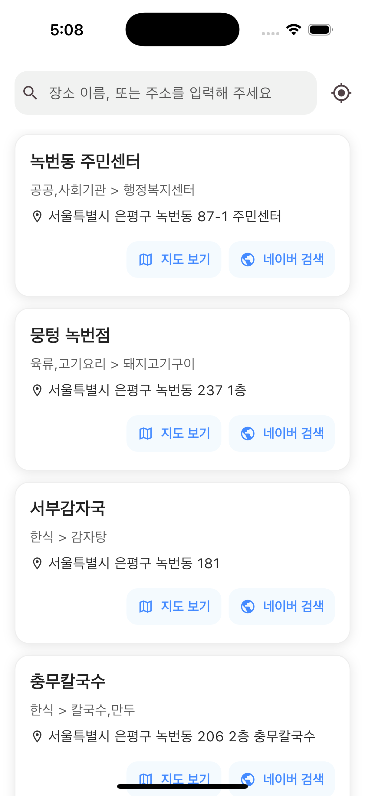
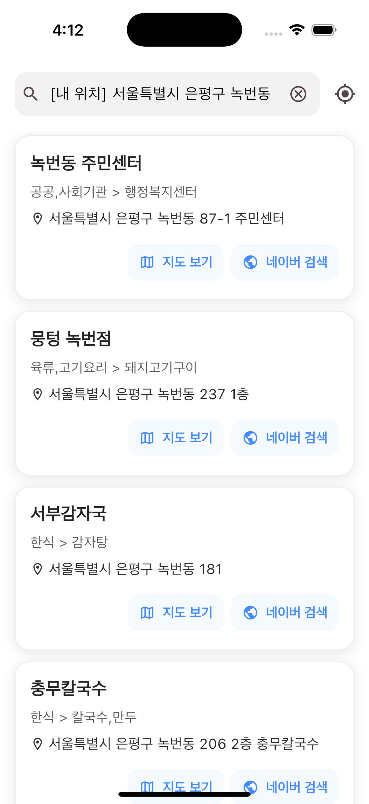
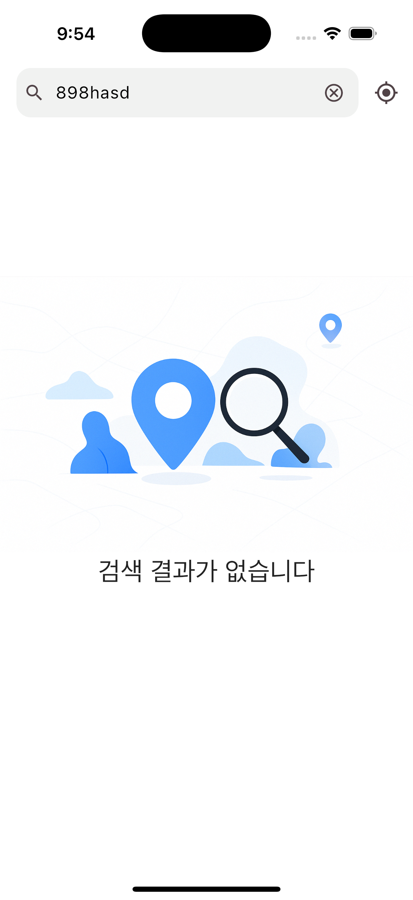
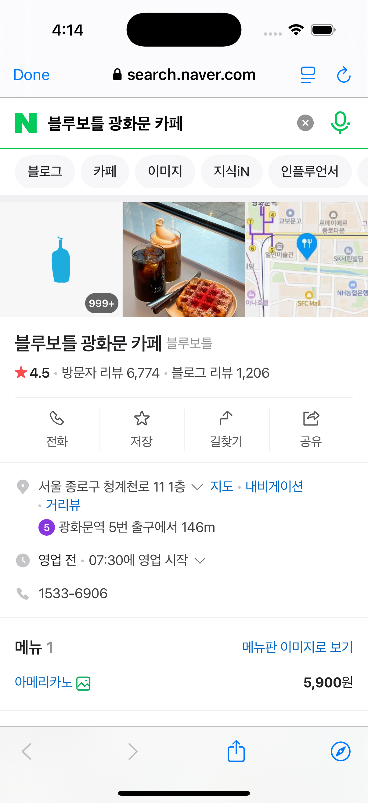
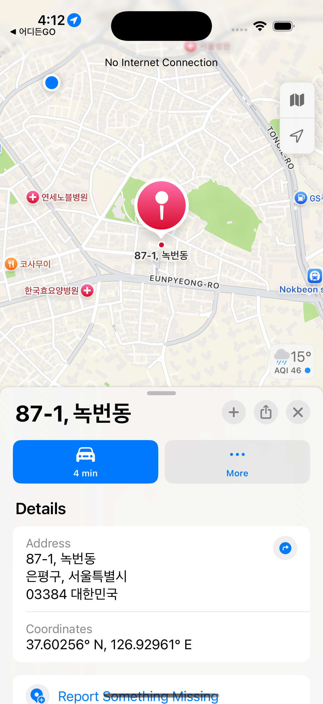
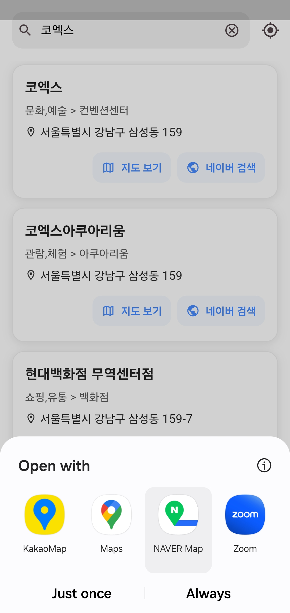
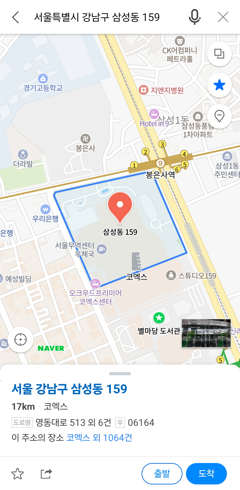
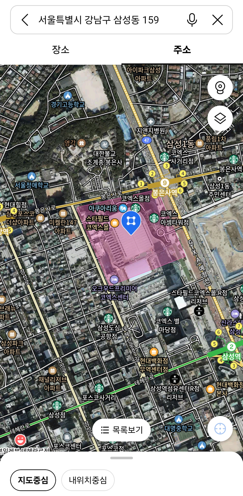

# 어이든GO - 지역 검색 앱

<p align="center">  </p>

## 📌 프로젝트 소개

어이든GO는 Flutter 기반의 지역 검색 애플리케이션입니다. 사용자는 장소명이나 주소를 검색하여 네이버 API를 통해 지역 정보를 찾을 수 있으며, 현재 위치 기반 검색 기능을 제공합니다. 검색된 장소의 상세 정보를 웹뷰로 확인하고, 다양한 지도 앱에서 위치를 열어볼 수 있는 기능도 제공합니다.

## 📱 스크린샷

<div style="background-color: #F1F2F1; padding: 20px; border-radius: 12px;">
  <div style="display: flex; flex-wrap: wrap; gap: 20px; justify-content: flex-start;">
    
    
    
    
    
    
    
    
    
    
    
    
  </div>
</div>


## 🎯 주요 기능

- **장소명/주소 검색**: 검색창에 키워드를 입력하여 네이버 지역 검색 API를 통해 장소를 검색할 수 있습니다.
- **현재 위치 기반 검색**: GPS 아이콘을 클릭하여 현재 위치 주변의 장소를 검색할 수 있습니다.
- **장소 상세 정보**: 검색된 장소를 클릭하면 네이버 웹페이지를 통해 상세 정보를 확인할 수 있습니다.
- **지도 앱 연동**: 장소를 선택하여 사용자 기기에 설치된 지도 앱에서 해당 위치를 열어볼 수 있습니다.
- **네이버 검색 기능**: 각 장소 카드의 "네이버 검색" 버튼으로 Android에서는 Custom Tabs, iOS에서는 SFSafariViewController를 사용하여 앱 내에서 네이버 검색 결과를 확인할 수 있습니다.

## ✨ 추가 구현 기능

### 1. 오류 처리 및 사용자 피드백

- **맞춤형 오류 화면**: 네트워크 연결 오류, 검색 결과 없음 등의 상황에 대한 맞춤형 레이아웃을 제공합니다.
- **웹뷰 로딩 및 오류 표시**: 웹뷰 로딩 중 인디케이터와 오류 시 다이얼로그를 표시합니다.
- **환경 변수 검증**: .env 파일의 API 키가 올바르게 설정되었는지 검증합니다.

### 2. 지도 연동 기능

- **앱 시작 시 주변 장소 로드**: 앱 실행 시 자동으로 주변 장소 정보를 로드합니다.
- **네이버 검색 기능**: 검색된 장소를 네이버에서 추가 검색할 수 있는 기능을 제공합니다.
- **멀티 지도 앱 연동**:
    - **Android**: 사용자가 기기에 설치된 지도 앱 중 선택하여 장소를 열 수 있습니다.
    - **iOS**: 네이버 지도 앱이 설치되어 있으면 네이버 지도로, 없으면 애플 지도로 장소를 엽니다.

### 3. 사용자 경험 향상

- **검색창 클리어 버튼**: 검색창에 텍스트가 있을 때 나타나는 클리어 버튼으로 빠르게 검색어를 지울 수 있습니다.
- **툴팁**: 사용자가 긴 주소를 쉽게 읽을 수 있도록 툴팁을 제공합니다.
- **로딩 인디케이터**: 데이터 로딩 중임을 시각적으로 표시하여 사용자 경험을 개선합니다.
- **스낵바 알림**: 링크가 없는 장소나 기타 알림을 스낵바로 표시합니다.
- **연속 스낵바 중복 방지**: 새로운 스낵바가 표시되기 전에 이전 스낵바가 자동으로 숨겨집니다.

### 4. 기타 향상된 기능

- **검색창 텍스트 자동 설정**: 현재 위치 검색 시 검색창에 "[현재 위치] 동네명"으로 텍스트가 자동 설정됩니다.
- **검색 아이콘 접두사**: 검색창에 검색 아이콘을 추가하여 직관적인 UI를 제공합니다.
- **빈 검색어 처리**: 빈 검색어로 검색하지 않도록 예외 처리를 추가했습니다.

## 📋 프로젝트 구조

```
lib/
├── app/                              # 애플리케이션 설정 및 구성 관련 파일
│   ├── constants/                    # 앱 전체에서 사용되는 상수 정의
│   │   ├── app_colors.dart           # 앱의 색상 테마 및 색상 상수
│   │   ├── app_constants.dart        # 앱에서 사용되는 일반 상수값 (문자열, 숫자 등)
│   │   └── app_styles.dart           # 앱의 텍스트 스타일, 여백 등 스타일 상수
│   ├── app_providers.dart            # Riverpod 프로바이더 설정 및 전역 상태 정의
│   └── theme.dart                    # 앱의 MaterialApp 테마 설정
│
├── core/                             # 핵심 기능 및 공통 유틸리티 클래스
│   ├── exceptions/                   # 앱 전체에서 사용되는 예외 클래스
│   │   └── data_exceptions.dart      # API 및 데이터 관련 예외 정의
│   ├── services/                     # 비즈니스 로직 및 외부 서비스 연동
│   │   └── map_launcher_service.dart
│   └── utils/                        # 헬퍼 함수 및 유틸리티 클래스
│       ├── geolocator_util.dart
│       ├── snackbar_util.dart
│       └── string_format_utils.dart
│
├── data/                             # 데이터 관련 클래스 및 데이터 액세스 계층
│   ├── dto/                          # 데이터 전송 객체 (API 응답 직접 매핑용)
│   │   ├── naver_place_dto.dart
│   │   └── vworld_district_dto.dart
│   ├── model/                        # 앱 내에서 사용되는 데이터 모델
│   │   └── place.dart                # 장소 정보를 나타내는 모델 클래스
│   ├── network/                      # 네트워크 통신 관련 클래스
│   │   └── dio_clients.dart
│   └── repository/                   # 데이터 접근 및 비즈니스 로직 구현
│       └── location_repository.dart
│
├── ui/                               # 사용자 인터페이스 관련 코드
│   ├── pages/                        # 앱의 주요 화면들
│   │   ├── home/                     # 홈 화면 관련 파일
│   │   │   ├── home_page.dart
│   │   │   ├── home_view_model.dart
│   │   │   └── widgets/              # 홈 화면 전용 위젯
│   │   │       └── home_list_item.dart
│   │   └── web/                      # 웹뷰 화면 관련 파일
│   │       ├── place_web_page.dart
│   │       └── place_web_page_view_model.dart
│   └── widgets/                      # 앱 전체에서 재사용 가능한 공통 위젯
│       └── error_layout.dart
│
└── main.dart                         # 앱의 진입점
```

## 📦 의존성 패키지

프로젝트에서 사용된 주요 패키지:

- **flutter_riverpod**: 상태 관리 및 의존성 주입
- **dio**: HTTP 클라이언트로 API 요청 처리
- **flutter_inappwebview**: 앱 내 웹뷰 구현
- **geolocator**: 현재 위치 좌표 획득
- **url_launcher**: 외부 앱 및 URL 실행
- **flutter_dotenv**: 환경 변수 관리

## 🔧 환경 설정

`.env` 파일을 프로젝트 루트 디렉토리에 생성하고 다음과 같이 API 키를 설정합니다:

```
NAVER_CLIENT_ID=네이버_클라이언트_ID
NAVER_CLIENT_SECRET=네이버_클라이언트_시크릿
VWORLD_API_KEY=VWORLD_API_키
```

## 📄 라이센스

이 프로젝트는 MIT 라이센스 하에 제공됩니다. 자세한 내용은 [LICENSE](LICENSE) 파일을 참조하세요.